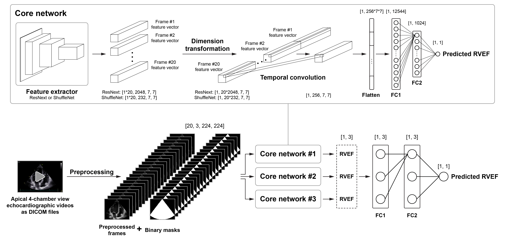
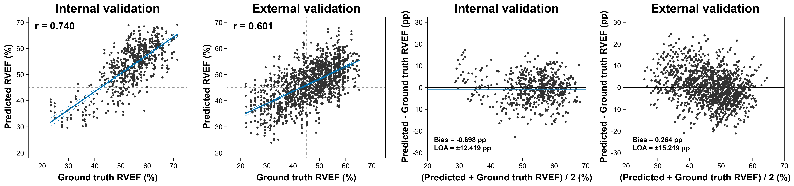

# RVENet-Demo: A Deep Learning Model for the Prediction of Right Ventricular Ejection Fraction From 2D Echocardiograms


The purpose of this repository is to enable the testing of our deep learning model that was developed for estimating right ventricular ejection fraction (RVEF) from 2D apical 4-chamber view echocardiographic videos. For detailed information about our model and the entire data analysis pipeline, please refer to the following paper:

> [**Deep Learning-Based Prediction of Right Ventricular Ejection Fraction Using 2D Echocardiograms**](https://rvenet.github.io/dataset/)<br/>
  Márton Tokodi, Bálint Magyar, András Soós, Masaaki Takeuchi, Máté Tolvaj, Bálint K. Lakatos, Tetsuji Kitano, Yosuke Nabeshima, Alexandra Fábián, Mark B. Szigeti, András Horváth, Béla Merkely, and Attila Kovács. (<b>under review</b>)

## Clinical Significance


Two-dimensional echocardiography is the most frequently performed imaging test to assess RV function. However, conventional 2D parameters are unable to reliably capture RV dysfunction across the entire spectrum of cardiac diseases. Three-dimensional echocardiography-derived RVEF – a sensitive and reproducible parameter that has been validated against cardiac magnetic resonance imaging – can bypass most of their limitations. Nonetheless, 3D echocardiography has limited availability, is more time-consuming, and requires significant human expertise. Therefore, novel automated tools that utilize readily available and routinely acquired 2D echocardiographic recordings to predict RVEF and detect RV dysfunction reliably would be highly desirable.

## Brief Description of the Deep Learning Pipeline


Our deep learning pipeline was designed to analyze a DICOM file containing a 2D apical 4-chamber view echocardiographic video to predict 3D echocardiography-derived RVEF as a continuous variable. Following a multi-step preprocessing (see details in our paper and the `demo.ipynb` Jupyter Notebook), the preprocessed frames of the video and the binary masks are passed to a deep learning model which is an <ins>**ensemble of three spatiotemporal neural networks**</ins>. Each of these networks (i.e., core networks) consists of three key components:

  1) a **feature extractor** (ResNext or ShuffleNet) that derives unique features from each frame,<br/>
  2) a **temporal convolutional layer** that combines the extracted features to evaluate temporal changes,
  3) and a **regression head** (comprising two fully connected layers), which returns a single predicted RVEF value.

Mean absolute error was used as the loss function. As the ensemble model was trained to analyze one cardiac cycle at a time, the average of the per-cardiac cycle predictions was calculated to get a single predicted RVEF value for a given video.


<div align="center"><i><b>Figure 1</b> Schematic illustration of the network architecture</i></div>

## Datasets Used for Model Development and Evaluation


A large single-center dataset – comprising 3,583 echocardiographic videos of 831 subjects (in DICOM format) and the corresponding labels (e.g., 3D echocardiography-derived RVEF) – was used for the training and internal validation of our model (approx. 80:20 ratio). To encourage collaborations and promote further innovation, we made this dataset publicly available (<ins>**RVENet dataset**</ins> – https://rvenet.github.io/dataset/). The performance of our model was also evaluated in an external dataset containing 1,493 videos of 365 patients.


<div align="center"><i><b>Figure 2</b> Apical 4-chamber view echocardiographic videos sampled from the RVENet dataset</i></p></div>

## Performance of the Deep Learning Model


Our deep learning model predicted RVEF with a mean absolute error of 5.056 percentage points (R<sup>2</sup>=0.500) in the internal and 6.111 percentage points (R<sup>2</sup>=0.329) in the external validation set. Bland-Altman analysis showed a statistically significant but clinically negligible bias between the predicted and ground truth RVEF values in the internal dataset (bias: -0.698 percentage points, p=0.007) but no significant bias in the external dataset (bias: 0.264 percentage points, p=0.590). 


<div align="center"><i><b>Figure 3</b> Performance of the deep learning model in the internal and external validation sets</i></div>

## Contents of the Repository


  - `demo.ipynb` - use this Jupyter Notebook to test our deep learning pipeline
  - `model.py` - model definition
  - `preprocessing.py` - functions required for preprocessing
  - `license.txt` - details of the license

## Usage

You can try our model in the online Google Colab environment (see below), or locally on your machine using the `predict.py` script.<br>
To run the code on your machine, you need a GPU with at least 8GB of memory. You also have to install the python packages from the `requirements.txt`.<br>
You can find the pretrained model weights [here](https://www.dropbox.com/s/d1w0nh1rzclo4ox/full_ensemble_model.pt?dl=1).<br>
For further information run the following command: <br>
```
python predict.py --help
```  

### Running the Jupyter Notebook in Google Colab

[](https://colab.research.google.com/github/mr-BM/RVEnet-demo/blob/master/demo.ipynb)<br>
If you want to test our model on a few DICOM files, the most convenient option is to open and run the `demo.ipynb` Jupyter Notebook in Google Colab.

### Running the Code on Your Own System

If you want to use our model to evaluate a large number of DICOM files, we recommend to ...
